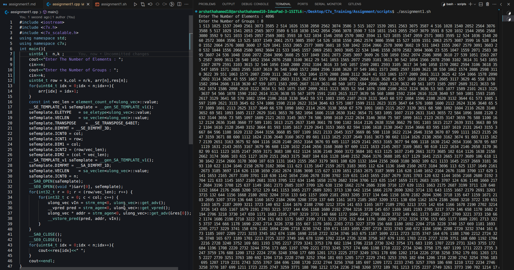

## Assignment
### Pseudo Code
1. Consider the 1D array as 2D Array 
1. With the help of streaming generator , access the element in column wise (Transpose)
1. Store the element in the result array using Address Generator
```cpp
n = Total Number of Elements

__SE_TEMPLATE_v1 seTemplate = __gen_SE_TEMPLATE_v1();
seTemplate.ELETYPE   = se_eletype<ulong_vec>::value;
seTemplate.VECLEN    = se_veclen<ulong_vec>::value;
seTemplate.TRANSPOSE    = __SE_TRANSPOSE_64BIT;
seTemplate.DIMFMT = __SE_DIMFMT_3D;
seTemplate.ICNT0 = col;
seTemplate.ICNT1 = row;                 
seTemplate.DIM1 = col;
seTemplate.ICNT2 = (row/vec_len);  
seTemplate.DIM2 = (col * vec_len);
__SA_TEMPLATE_v1 saTemplate = __gen_SA_TEMPLATE_v1();
saTemplate.DIMFMT = __SA_DIMFMT_1D;
saTemplate.VECLEN    = sa_veclen<ulong_vec>::value;
saTemplate.ICNT0 = n;
```

### Output
